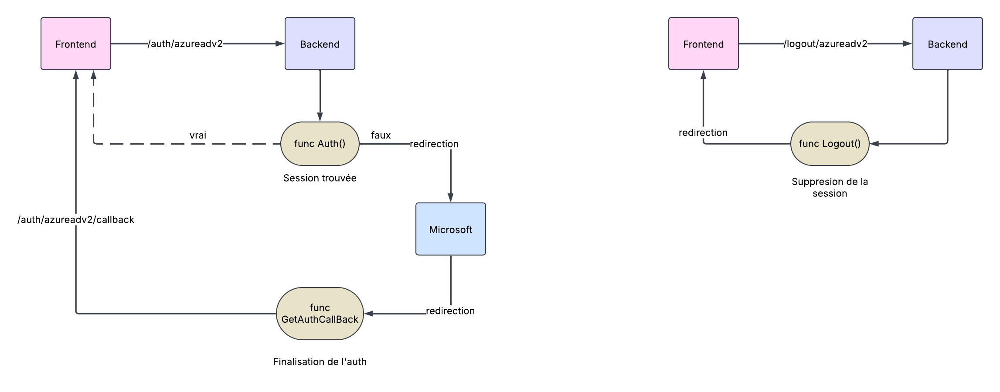

# Authentification Microsoft avec Goth en Go

Goth est une bibliothèque qui facilite l'implémentation de l'authentification OAuth avec des fournisseurs externes. L'API du **LLIO** est configurée pour l'authentification avec Microsoft (**Azure AD**, plus récemment renommé **Entra ID**).

## Providers pris en charge

Goth prend en charge plusieurs fournisseurs d'authentification, tels que :

- **GitHub**
- **Google**
- **Facebook**, etc.

Dans notre cas, nous utilisons **azureadv2**, une version mise à jour de **azuread**, basée sur **OAuth2**.

## Prérequis

### Goth : gestion de l'authentification

```bash
go get github.com/markbates/goth
```

### Gorilla Sessions : gestion des sessions utilisateur

```bash
go get github.com/gorilla/sessions
```

## Variables d'environnement

```bash
AZUREAD_CLIENT_ID=votre_client_id
AZUREAD_CLIENT_SECRET=votre_client_secret
AZUREAD_CALLBACK_URL=http://localhost:8080/auth/azureadv2/callback
SESSION_SECRET=votre_secret_de_session
SESSION_MAX_AGE=86400     # Une journée
FRONTEND_URL=http://localhost:5173/llio-frontend
```

- **ClientID** et **ClientSecret** : Identifiants fournis par **Azure AD** après l'enregistrement de notre application. Ils permettent d'identifier le client auprès du fournisseur.
- **Callback URL** : URL de **callback** configurée dans **Azure AD**, appelée après l'authentification.
- **Session secret** : Secret utilisé pour sécuriser les sessions utilisateur.
- **Session max age** : Durée de vie maximale de la session utilisateur.
- **Frontend URL** : URL du **front** utilisée pour effectuer une redirection après l'authentification.

---

# Configuration

### Configuration du provider

1. **Chargement des variables d'environnement nécessaires à la configuration du provider**

```go
// Chargement des variables d'environnement
useful.LoadEnv()
authenticationConfig := struct {
    AzureAdClientID string
    AzureAdSecret   string
    AzureAdCallback string
}{
    AzureAdClientID: os.Getenv("AZUREAD_CLIENT_ID"),
    AzureAdSecret:   os.Getenv("AZUREAD_CLIENT_SECRET"),
    AzureAdCallback: os.Getenv("AZUREAD_CALLBACK_URL"),
}

// Vérification des variables d'environnement
if authenticationConfig.AzureAdClientID == "" || 
   authenticationConfig.AzureAdSecret == "" || 
   authenticationConfig.AzureAdCallback == "" {
    log.Fatal("Les variables d'environnement Azure AD ne sont pas définies")
}
```

2. **Initialisation et configuration du provider `azureadv2` en passant les paramètres nécessaires**

```go
// Configuration du provider Azure AD
goth.UseProviders(
    azureadv2.New(
        authenticationConfig.AzureAdClientID,
        authenticationConfig.AzureAdSecret,
        authenticationConfig.AzureAdCallback,
        azureadv2.ProviderOptions{
            Tenant: azureadv2.OrganizationsTenant, // Limiter l'authentification à l'organisation uniquement
            Scopes: []azureadv2.ScopeType{ // Définition des scopes (permissions demandées)
                azureadv2.OpenIDScope,
            },
        },
    ),
)
```

### Configuration des sessions

1. **Chargement des variables d'environnement nécessaires à la configuration de la session**

```go
// Configuration des sessions
sessionsConfig := struct {
    SessionKey    string
    SessionMaxAge int
    HttpOnly      bool
    IsProduction  bool
}{
    SessionKey:    os.Getenv("SESSION_SECRET"),
    SessionMaxAge: useful.GetEnvInt("SESSION_MAX_AGE", 86400),
    HttpOnly:      true,
    IsProduction:  useful.GetEnvBool("ENV", false),
}
```

2. **Configuration de la session utilisateur en utilisant le stockage de Goth (`gothic.Store`) où l'on stocke la session de l'utilisateur dans un cookie sécurisé**

```go
// Configuration du cookie store pour les sessions
store := sessions.NewCookieStore([]byte(sessionsConfig.SessionKey))
store.MaxAge(sessionsConfig.SessionMaxAge)
store.Options.Path = "/"
store.Options.HttpOnly = sessionsConfig.HttpOnly
store.Options.Secure = sessionsConfig.IsProduction
store.Options.SameSite = http.SameSiteLaxMode

gothic.Store = store
```

---

# Routes

```go
func AuthRoutes(r *gin.Engine) {
    r.GET("/auth/:provider/callback", controllers.GetAuthCallback)
    r.GET("/logout/:provider", controllers.Logout)
    r.GET("/auth/:provider", controllers.Auth)
}
```

- Route pour rediriger vers l'authentification Microsoft : **/auth/azureadv2**
- Route de **callback** après l'authentification : **/auth/azureadv2/callback**
- Route pour la déconnexion de l'utilisateur : **/logout/azureadv2**

---

# Controller

### 1. Vérification et redirection vers Microsoft si l'utilisateur n'est pas encore authentifié

```go
func Auth(c *gin.Context) {
    provider := c.Param("provider")
    log.Printf("Tentative d'authentification avec le provider %s", provider)
    q := c.Request.URL.Query()
    q.Add("provider", provider)
    c.Request.URL.RawQuery = q.Encode()

    if gothUser, err := gothic.CompleteUserAuth(c.Writer, c.Request); err == nil {
        log.Printf("Utilisateur authentifié: %s", gothUser.Email)
        c.JSON(http.StatusOK, gin.H{"user": gothUser})
    } else {
        log.Printf("Début de l'authentification avec le provider %s", provider)
        gothic.BeginAuthHandler(c.Writer, c.Request)
    }
}
```

### 2. Callback après authentification pour enregistrer la session et rediriger vers le frontend

```go
func GetAuthCallback(c *gin.Context) {
    useful.LoadEnv()
    frontendURL := os.Getenv("FRONTEND_URL")
    provider := c.Param("provider")
    log.Printf("Callback d'authentification avec le provider %s", provider)

    user, err := gothic.CompleteUserAuth(c.Writer, c.Request) // Finalisation de l'authentification
    if err != nil {
        log.Printf("Erreur lors de l'authentification: %v", err)
        c.JSON(http.StatusInternalServerError, gin.H{"error": err.Error()})
        return
    }

    log.Printf("Utilisateur authentifié: %s", user.Email)
    http.Redirect(c.Writer, c.Request, frontendURL+"/calendar", http.StatusFound) // Redirection vers le frontend
}
```

### 3. Déconnexion de l'utilisateur en supprimant la session

```go
func Logout(c *gin.Context) {
    useful.LoadEnv()
    frontendURL := os.Getenv("FRONTEND_URL")

    if err := gothic.Logout(c.Writer, c.Request); err != nil {  // Suppression de la session 
        log.Printf("Erreur lors de la déconnexion: %v", err)
        c.JSON(http.StatusInternalServerError, gin.H{"error": err.Error()})
        return
    }

    http.Redirect(c.Writer, c.Request, frontendURL, http.StatusFound) // Redirection vers la page de connexion
}
```

---

# Workflow de l'authentification



# Ressources et documentation

- [Documentation de Goth](https://github.com/markbates/goth)
- [Documentation Azure AD OAuth 2.0](https://docs.microsoft.com/fr-fr/azure/active-directory/develop/v2-oauth2-auth-code-flow)
- [Documentation Gorilla Sessions](https://github.com/gorilla/sessions)
- [Tutoriel d'authentification Goth](https://youtu.be/iHFQyd__2A0?si=oodfBtStFZa6hbpy)
