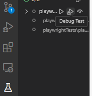
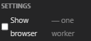
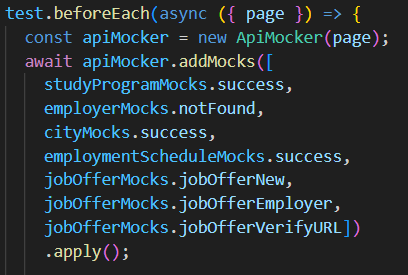

# 🎭 Playwright

## Description

Les tests Playwright sont des tests frontend qui servent à **reproduire le comportement** d'un utilisateur régulier pour une page ou une fonctionnalité. Vous pouvez lui faire remplir des champs d'édition ou cliquer sur des boutons.

## Installation

Se placer dans le répertoire `/playwrightTests.`

Installer les modules npm `npm install`.

Exécuter la commande `npx playwright install`

Ajouter l'extension au module vscode : [Lien](https://marketplace.visualstudio.com/items?itemName=ms-playwright.playwright)

## Rouler les tests automatiquement

Pour rouler les test, faire `npm run test`

La commande va démarrer flask et svelte et en suite rouler les tests.

Les tests s'exécutent sur le port 5002, il ne faut pas qu'un processus s'exécute déjà sur ce port.

## Debug

Les tests peuvent être exécutés en debug, avec la possbilité d'insérer des points d'arrêt.

L'option Show browser permet de suivre les actions de l'agent de test en temps réel sur le navigateur.

## Ajouter des tests

Pour ajouter des tests, il faut créer un fichier correspondant à la fonctionnalité à tester.

Dans le beforeEach, il faut appeler le mockApi et indiquer les routes à intercepter par le Mock. Ces routes doivent correspondre aux appels faits à l'API pendant le processus normal que Playwright va reproduire.

Si vous avez ajouté des routes ou qu'un des appels n'est pas pris en compte dans les fichiers de routes déjà présents, il faut ajouter une interception ou un résultat et l'importer dans votre fichier de test.

### Teardown

En bas, dans les options, il y a globalteardown pour supprimer les instances des serveurs spawnées. À utiliser avant certains tests (register) ou si on fait des changements dans le serveur flask.
